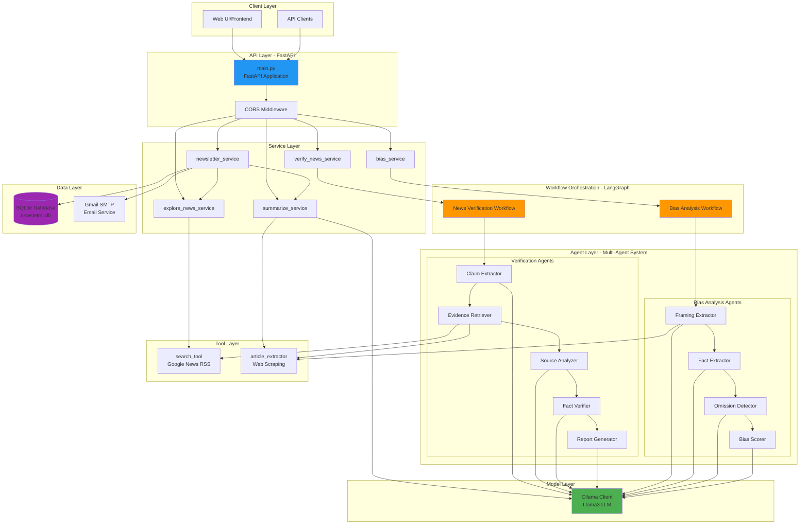
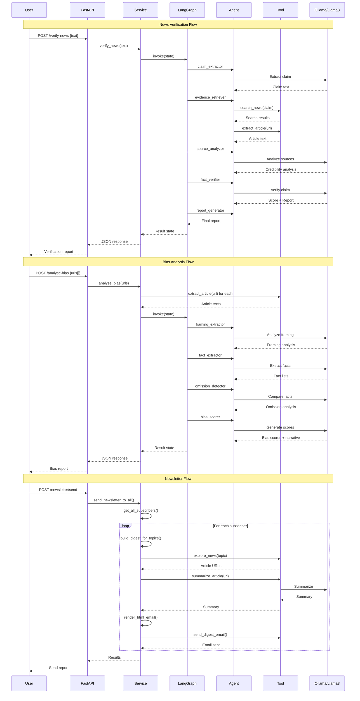

# VeritasAI - AI-Powered News Verification & Analysis System


## 📋 Table of Contents
- [Overview](#overview)
- [Features](#features)
- [Architecture](#architecture)
- [System Components](#system-components)
- [Data Flow](#data-flow)
- [Installation](#installation)
- [API Endpoints](#api-endpoints)
- [Function Reference](#function-reference)
- [Configuration](#configuration)
- [Usage Examples](#usage-examples)

---

## 🎯 Overview

**VeritasAI** is an advanced AI-powered news verification and analysis system that leverages multi-agent workflows to fact-check news, detect media bias, summarize articles, and deliver personalized news digests. Built with FastAPI and LangGraph, it uses local LLM (Llama3 via Ollama) for intelligent analysis.

### Key Capabilities
- **Fact Verification**: Multi-agent pipeline for claim extraction, evidence retrieval, and credibility scoring
- **Bias Detection**: Comparative analysis of multiple news sources to identify framing, omissions, and political lean
- **News Summarization**: AI-powered article summarization with paywall bypass strategies
- **News Exploration**: Real-time news search via Google News RSS
- **Newsletter Service**: Automated personalized news digests with email delivery

---

## ✨ Features

### 1. News Verification System
- Extracts factual claims from news text
- Retrieves supporting/contradicting evidence from multiple sources
- Analyzes source credibility
- Generates comprehensive fact-check reports with credibility scores (0-100)

### 2. Bias Analysis System
- Compares 2-4 articles covering the same story
- Analyzes framing, tone, and narrative angles
- Detects factual omissions and contradictions
- Scores political lean, emotional intensity, and completeness
- Generates comparative bias reports

### 3. Article Summarization
- Extracts full article text with multiple fallback strategies
- Handles paywalls and JavaScript-rendered content
- Generates concise 5-7 sentence summaries

### 4. News Discovery
- Real-time news search via Google News RSS
- Resolves Google News redirect URLs to actual article URLs
- Multi-threaded URL resolution for performance

### 5. Newsletter Service
- SQLite-based subscriber management
- Topic-based personalized digests
- HTML email templates with dark theme
- Automated daily newsletter delivery via Gmail SMTP
- User self-service subscription management

---

## 🏗️ Architecture

### System Architecture Diagram



### Data Flow Architecture



---

## 🔧 System Components

### 1. API Layer (`backend/main.py`)

**FastAPI Application** - Main entry point with REST endpoints

#### Key Classes:
- `NewsInput(BaseModel)` - Input model for news verification
- `UrlInput(BaseModel)` - Input model for URL-based operations
- `BiasInput(BaseModel)` - Input model for bias analysis
- `SubscribeInput(BaseModel)` - Newsletter subscription model
- `SendNewsletterInput(BaseModel)` - Newsletter sending model
- `PreviewInput(BaseModel)` - Newsletter preview model

#### Key Functions:
- `check_admin(password: str)` - Admin authentication
- `verify(input: NewsInput)` - News verification endpoint
- `summarize(input: UrlInput)` - Article summarization endpoint
- `explore(topic: str)` - News exploration endpoint
- `bias_analysis(input: BiasInput)` - Bias analysis endpoint
- `news_ticker()` - Multi-category news ticker
- `debug_rss(topic: str)` - RSS feed debugging
- `resolve_url(url: str)` - Google News URL resolver

### 2. Service Layer

#### `backend/services/verify_news_service.py`
**Functions:**
- `verify_news(news_text: str) -> dict` - Orchestrates news verification workflow

#### `backend/services/summarize_service.py`
**Functions:**
- `summarize_article(url: str) -> dict` - Extracts and summarizes articles

#### `backend/services/explore_news_service.py`
**Functions:**
- `explore_news(topic: str) -> list` - Searches news by topic

#### `backend/services/bias_service.py`
**Functions:**
- `analyse_bias(urls: list[str]) -> dict` - Orchestrates bias analysis workflow

#### `backend/services/newsletter_service.py`
**Functions:**
- `init_db()` - Initialize SQLite database
- `subscribe(email: str, topics: list[str]) -> dict` - Add/update subscriber
- `unsubscribe(email: str) -> dict` - Remove subscriber
- `get_all_subscribers() -> list[dict]` - Retrieve all subscribers
- `get_subscriber(email: str) -> dict | None` - Get single subscriber
- `remove_topic(email: str, topic: str) -> dict` - Remove topic from subscription
- `build_digest_for_topics(topics: list[str], articles_per_topic: int) -> list[dict]` - Build news digest
- `render_html_email(recipient_email: str, sections: list[dict]) -> str` - Generate HTML email
- `send_digest_email(recipient: str, sections: list[dict]) -> dict` - Send email via SMTP
- `send_newsletter_to_all() -> dict` - Send to all subscribers
- `send_preview(email: str, topics: list[str]) -> dict` - Send preview email

### 3. Workflow Layer (LangGraph)

#### `backend/graph/workflow.py`
**Functions:**
- `create_workflow() -> CompiledGraph` - Creates news verification workflow

**Workflow Graph:**
```
claim_extractor → evidence_retriever → source_analyzer → fact_verifier → report_generator → END
```

#### `backend/graph/bias_workflow.py`
**Functions:**
- `create_bias_workflow() -> CompiledGraph` - Creates bias analysis workflow

**Workflow Graph:**
```
framing_extractor → fact_extractor → omission_detector → bias_scorer → END
```

#### `backend/graph/state.py`
**State Definitions:**
- `AgentState(TypedDict)` - State for verification workflow
  - `input_news: str`
  - `claim: str`
  - `evidence: List[str]`
  - `sources: List[str]`
  - `credibility_score: float`
  - `summary: str`
  - `report: str`

- `BiasState(TypedDict)` - State for bias workflow
  - `articles: List[Dict[str, Any]]`
  - `framing_results: List[Dict[str, Any]]`
  - `fact_results: List[Dict[str, Any]]`
  - `omission_analysis: str`
  - `bias_scores: List[Dict[str, Any]]`
  - `bias_narrative: str`
  - `final_report: str`

### 4. Agent Layer

#### Verification Agents

**`backend/agents/claim_extractor.py`**
- `claim_extractor(state: AgentState) -> AgentState` - Extracts main factual claim

**`backend/agents/evidence_retriever.py`**
- `evidence_retriever(state: AgentState) -> AgentState` - Retrieves supporting evidence

**`backend/agents/source_analyzer.py`**
- `source_analyzer(state: AgentState) -> AgentState` - Analyzes source credibility

**`backend/agents/fact_verifier.py`**
- `fact_verifier(state: AgentState) -> AgentState` - Verifies claims and scores credibility

**`backend/agents/report_generator.py`**
- `report_generator(state: AgentState) -> AgentState` - Generates final report

**`backend/agents/news_summarizer.py`**
- `summarize_article(url: str) -> dict` - Summarizes articles with fallback strategies
- `_fetch_with_session(url: str) -> str` - Session-based fetching for cookie-gated sites

#### Bias Analysis Agents

**`backend/agents/framing_extractor.py`**
- `framing_extractor(state: BiasState) -> BiasState` - Analyzes article framing and tone

**`backend/agents/fact_extractor.py`**
- `fact_extractor(state: BiasState) -> BiasState` - Extracts verifiable facts

**`backend/agents/omission_detector.py`**
- `omission_detector(state: BiasState) -> BiasState` - Detects omissions and contradictions

**`backend/agents/bias_scorer.py`**
- `bias_scorer(state: BiasState) -> BiasState` - Generates bias scores and narrative

### 5. Tool Layer

#### `backend/tools/search_tool.py`
**Functions:**
- `search_news(query: str) -> list[dict]` - Searches Google News RSS
- `_find_article_on_site(title: str, source_url: str) -> str` - Resolves article URLs

#### `backend/tools/article_extractor.py`
**Functions:**
- `extract_article(url: str) -> str` - Extracts article text with multiple strategies
- `_parse_html(html: str) -> str` - Parses HTML to extract article content
- `_fetch(url: str) -> str` - Fetches URL with headers
- `_to_amp(url: str) -> str` - Converts to AMP URL for Indian news sites

**Extraction Strategies:**
1. Direct fetch with BeautifulSoup
2. AMP version (for Times of India, Hindustan Times, NDTV)
3. Google AMP cache

### 6. Model Layer

#### `backend/models/ollama_client.py`
**Functions:**
- `get_llm() -> ChatOllama` - Returns configured Llama3 LLM instance

**Configuration:**
- Model: `llama3`
- Temperature: `0` (deterministic)

---

## 📊 Data Flow

### News Verification Flow
1. **User Input** → News text submitted via `/verify-news`
2. **Claim Extraction** → LLM extracts main factual claim
3. **Evidence Retrieval** → Google News search + article extraction
4. **Source Analysis** → LLM evaluates source credibility
5. **Fact Verification** → LLM verifies claim against evidence (0-100 score)
6. **Report Generation** → Comprehensive fact-check report
7. **Response** → JSON with claim, score, sources, analysis

### Bias Analysis Flow
1. **User Input** → 2-4 article URLs via `/analyse-bias`
2. **Article Extraction** → Full text extraction for each URL
3. **Framing Analysis** → LLM analyzes tone, narrative, perspective
4. **Fact Extraction** → LLM extracts key facts from each article
5. **Omission Detection** → LLM compares facts across articles
6. **Bias Scoring** → LLM generates political lean, emotional intensity, completeness scores
7. **Response** → JSON with comparative analysis and scores

### Newsletter Flow
1. **Scheduled/Manual Trigger** → `/newsletter/send` endpoint
2. **Subscriber Retrieval** → Fetch all subscribers from SQLite
3. **Topic Processing** → For each subscriber's topics:
   - Search news via Google News RSS
   - Extract and summarize top 4 articles per topic
4. **Email Generation** → Render HTML email with dark theme
5. **Email Delivery** → Send via Gmail SMTP
6. **Response** → Delivery status report

---

## 🚀 Installation

### Prerequisites
- Python 3.8+
- Ollama with Llama3 model installed
- Gmail account with App Password (for newsletter feature)

### Setup Steps

1. **Clone the repository**
```bash
git clone <repository-url>
cd "Ai News System"
```

2. **Install dependencies**
```bash
pip install -r requirements.txt
```

3. **Install Ollama and Llama3**
```bash
# Install Ollama from https://ollama.ai
ollama pull llama3
```

4. **Configure environment variables**
Create `backend/.env`:
```env
ADMIN_PASSWORD=your_admin_password
GMAIL_USER=your_email@gmail.com
GMAIL_APP_PASSWORD=your_gmail_app_password
```

5. **Run the application**
```bash
uvicorn backend.main:app --reload --host 0.0.0.0 --port 8000
```

6. **Access the API**
- API: `http://localhost:8000`
- Docs: `http://localhost:8000/docs`

---

## 📡 API Endpoints

### News Verification
```http
POST /verify-news
Content-Type: application/json

{
  "text": "News headline or article text"
}
```

### Article Summarization
```http
POST /summarize-news
Content-Type: application/json

{
  "url": "https://example.com/article"
}
```

### News Exploration
```http
GET /explore-news?topic=technology
```

### Bias Analysis
```http
POST /analyse-bias
Content-Type: application/json

{
  "urls": [
    "https://source1.com/article",
    "https://source2.com/article"
  ]
}
```

### News Ticker
```http
GET /news-ticker
```

### Newsletter Subscription
```http
POST /newsletter/subscribe
Content-Type: application/json

{
  "email": "user@example.com",
  "topics": ["Technology", "Science"]
}
```

### Newsletter Management
```http
GET /newsletter/my-subscription?email=user@example.com
POST /newsletter/remove-topic
POST /newsletter/user-unsubscribe
POST /newsletter/send (Admin only)
GET /newsletter/subscribers?admin_password=xxx (Admin only)
```

---

## 📚 Function Reference

### Complete Function List by Module

#### **main.py** (8 endpoints)
- `verify()` - News verification
- `summarize()` - Article summarization
- `explore()` - News search
- `bias_analysis()` - Bias analysis
- `news_ticker()` - Multi-category news
- `debug_rss()` - RSS debugging
- `resolve_url()` - URL resolution
- `check_admin()` - Admin auth

#### **Services** (15 functions)
- `verify_news()` - Verification orchestration
- `summarize_article()` - Summarization orchestration
- `explore_news()` - News search orchestration
- `analyse_bias()` - Bias analysis orchestration
- `init_db()` - Database initialization
- `subscribe()` - Add subscriber
- `unsubscribe()` - Remove subscriber
- `get_all_subscribers()` - List subscribers
- `get_subscriber()` - Get single subscriber
- `remove_topic()` - Remove topic
- `build_digest_for_topics()` - Build digest
- `render_html_email()` - Generate email HTML
- `send_digest_email()` - Send email
- `send_newsletter_to_all()` - Bulk send
- `send_preview()` - Preview email

#### **Agents** (11 agents)
- `claim_extractor()` - Extract claims
- `evidence_retriever()` - Retrieve evidence
- `source_analyzer()` - Analyze sources
- `fact_verifier()` - Verify facts
- `report_generator()` - Generate reports
- `framing_extractor()` - Analyze framing
- `fact_extractor()` - Extract facts
- `omission_detector()` - Detect omissions
- `bias_scorer()` - Score bias
- `summarize_article()` - Summarize (agent version)
- `_fetch_with_session()` - Session fetch

#### **Tools** (6 functions)
- `search_news()` - Google News search
- `_find_article_on_site()` - URL resolution
- `extract_article()` - Article extraction
- `_parse_html()` - HTML parsing
- `_fetch()` - HTTP fetch
- `_to_amp()` - AMP conversion

#### **Workflows** (2 functions)
- `create_workflow()` - Verification workflow
- `create_bias_workflow()` - Bias workflow

#### **Models** (1 function)
- `get_llm()` - LLM client

---

## ⚙️ Configuration

### Environment Variables
```env
# Admin authentication
ADMIN_PASSWORD=your_secure_password

# Gmail SMTP for newsletters
GMAIL_USER=your_email@gmail.com
GMAIL_APP_PASSWORD=your_16_char_app_password
```

### Database
- **Type**: SQLite
- **Location**: `newsletter.db`
- **Schema**: 
  - `subscribers` table: id, email, topics (CSV), created

### LLM Configuration
- **Model**: Llama3 (via Ollama)
- **Temperature**: 0 (deterministic)
- **Provider**: LangChain Community ChatOllama

---

## 💡 Usage Examples

### Verify News
```python
import requests

response = requests.post("http://localhost:8000/verify-news", json={
    "text": "Scientists discover new planet in habitable zone"
})
print(response.json())
```

### Analyze Bias
```python
response = requests.post("http://localhost:8000/analyse-bias", json={
    "urls": [
        "https://cnn.com/article1",
        "https://foxnews.com/article2"
    ]
})
print(response.json())
```

### Subscribe to Newsletter
```python
response = requests.post("http://localhost:8000/newsletter/subscribe", json={
    "email": "user@example.com",
    "topics": ["Technology", "Science", "Politics"]
})
print(response.json())
```

---

## 🔍 Key Features Explained

### Multi-Agent Architecture
The system uses LangGraph to orchestrate multiple specialized AI agents:
- Each agent has a specific responsibility
- Agents pass state through a directed graph
- Enables complex reasoning through agent collaboration

### Paywall Bypass Strategies
1. **Direct Fetch**: Standard HTTP request with browser headers
2. **AMP Version**: Lightweight mobile version (Indian news sites)
3. **Google AMP Cache**: Cached version from Google's CDN
4. **Session-based**: Maintains cookies for gated content

### Bias Detection Methodology
1. **Framing Analysis**: Tone, language choice, narrative angle
2. **Fact Comparison**: What each source includes/omits
3. **Omission Detection**: Cross-reference facts across sources
4. **Scoring**: Political lean, emotional intensity, completeness

### Newsletter System
- **Personalization**: Topic-based content per subscriber
- **Dark Theme**: Professional email design
- **Unavailable Content Handling**: Graceful degradation for paywalled articles
- **Self-Service**: Users can manage subscriptions without admin

---

## 📦 Dependencies

```
newspaper3k - Article extraction
lxml_html_clean - HTML cleaning
fastapi - Web framework
uvicorn - ASGI server
python-dotenv - Environment management
langchain-community - LLM integration
langgraph - Multi-agent workflows
requests - HTTP client
beautifulsoup4 - HTML parsing
```

---

## 🤝 Contributing

This is an AI-powered news analysis system. Contributions are welcome for:
- Additional news sources
- Improved extraction strategies
- Enhanced bias detection algorithms
- UI/Frontend development
- Documentation improvements

---

## 📄 License

[Add your license here]

---

## 👨‍💻 Author

[Add your information here]

---

## 🙏 Acknowledgments

- **Ollama** - Local LLM runtime
- **LangChain** - LLM framework
- **LangGraph** - Multi-agent orchestration
- **FastAPI** - Modern Python web framework

---

**Built with ❤️ using AI and Python**